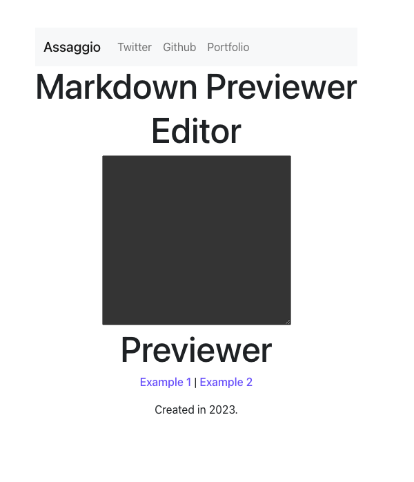

<!-- markdownlint-disable MD022 MD024 MD032 MD033 -->

# 100 Days of Code
<p class="toc"><a href="./index.html">&lt;– back to Table of Contents</a></p>

| Log 0 | Log 1 | Log Example |
| --- | --- | --- |
| [Log 0](log0.md) | this log |  [100 Days Round - Example](log8.html) |

## Challenge & Commitment
This self imposed challenge is using Alexander Kallaway's [100DaysOfCode](https://github.com/Kallaway/100-days-of-code "the official repo") challenge as template.More details about the challenge can be found here: [100daysofcode.com](http://100daysofcode.com/ "100daysofcode.com"). The aim is to hold myself accountable, thus, putting in the work to  grow as software professional.

**Commitment:** *I will code daily for an hr for the next 100 days.*

|  Start Date   | End Date     |
| ------------- | ------------ |
| Feb 27, 2023  | July 14, 2023 |

## Primary Goals
- [ ] Code for an hour daily building.
- [ ] Complete Burble rebuild.
- [ ] Create a #SmallPractices page (Learning Field/Blog)  ~> Learning Garden [What I am building, what I am learning, links to the documentation and live version].
- [ ] Complete Front End Development Libraries Certification  ~> (freeCodeCamp).
- [ ] Create new portfolio or version 3 of portfolio in React.

## Projects to Complete
- [ ] Burble v2
- [ ] FreeCodeCamp project FEDL certificate 1 ~> Assaggio 
- [ ] FreeCodeCamp project FEDL certificate 2
- [ ] FreeCodeCamp project FEDL certificate 3
- [ ] FreeCodeCamp project FEDL certificate 4
- [ ] Native Eats v1.
- [ ] AOB

## Code Log

---

## 0. Burble
### Day 0: Feb 27, 2023 - Monday

**Project:** Burble ~ Creating Additional Tests

**Progress:** Burble - Wrote additional tests and figuring out the a found bug.

**Links:** N/A

---

## 1. Burble
### Day 0: Feb 28, 2023 - Tuesday

**Project:** Burble ~ Found a bug

**Progress:** Burble - Tried to debug the issue with passing down the props.

**Links:** N/A

---

## 2. Assaggio 
### Day 2: March 19, 2023 - Sunday

**Project:** Assaggio && freeCodeCamp Atl Monthly Meetup

**Progress:** Restructuring the Markdown Project ~ Assaggio for fCC FEDL
              => Added bootstrap and fontawesome to project and refactored the navbar.
[](./assets/log1/day2.png)
  

**Links:** 
- [Reactstrap Vs. React-Bootstrap](https://medium.com/geekculture/reactstrap-vs-react-bootstrap-9bd3250809aa#:~:text=Reactstrap%20is%20a%20library%20of%20React%20components%20that%20provide%20Bootstrap,with%20Bootstrap%20styling%20using%20React.)
- [Font Awesome - Npm Docs](https://fontawesome.com/docs/web/setup/packages)

---

## 3. Burble
### Day 3: March 20, 2023 - Monday

**Project:** Revamping Test Suite to Complete Test Writing

**Progress:** Stuck as Tests were broken due to config and update issues.
  
**AOB** - Updated Portfolio re-spelling issues.

---
## 4. Burble 
### Day 4: March 21, 2023 - Tuesday

**Project:** Still having config issues ~ Burble
             Take home Problem Set - Trackonomy

**Progress:** Still having issues with cypress config
              Completed 3/4 problems and I failed.
  
**AOB** - Updated Portfolio re-spelling issues.
---

## 5. Burble 
### Day 5: March 22, 2023 - Wednesday

**Project:** Still having config issues ~ Burble
             Found a Markdown template for blogging.

**Progress:** Still having issues with cypress config
              Working on configuring Markdown blog to make work for current needs
  
**AOB** 
---

## 6. Burble 
### Day 6: March 23, 2023 - Thursday

**Project:** Still having config issues ~ Burble
             Found a Markdown template for blogging.

**Progress:** Still having issues with cypress config
              Working on configuring Markdown blog to make work for current needs
  
**AOB** 
---

## 7. FreeCodeCamp ~ Redux 
### Day 7: April 10, 2023 - Monday

**Project/Stuff Being Learn't :** Re:Walking through redux and understanding enclosed state via FCC
            
**Progress:** Completed 10/17 exercises

  
**AOB**  Understands this on a highlevel but the low leave stuff makes sense.

**Links:**  - [Redux Explained Simply ](https://dev.to/codebucks/what-is-redux-simply-explained-2ch7)
---

## 7.5. Job Interview Prep 
### Day 7.5: April 11, 2023 - Tuesday

**Project/Stuff Being Learn't :** You can tick all the boxes and still not be the right candidate. 

---

## 8. FreeCodeCamp ~ Redux || Paused for Redux
### Day 8: April 12, 2023 - Wednesday

**Project/Stuff Being Learn't :** Walking through a redux tutorial to cement a deeper understanding of all of its components that manages state.
            
**Progress:** Completed 10/17 exercises || Took a segway in a tutorial, linked below.

  
**AOB**  Refining my understanding of redux via tutorial build out and implementation. 

**Links:**  - [Learn Redux with Redux Toolkit ](https://youtu.be/fiesH6WU63I)
---

## 9. FreeCodeCamp ~ Redux || Paused for Redux
### Day 9: April 16, 2023 - Sunday

**Project/Stuff Being Learn't :** Walking through a redux tutorial to cement a deeper understanding of all of its components that manages state.
            
**Progress:** Completed 10/17 exercises || Took a segway in a tutorial, linked below.

  
**AOB**  Refining my understanding of redux via tutorial build out and implementation. 

**Links:**  - [Learn Redux with Redux Toolkit ](https://youtu.be/fiesH6WU63I)
---

## 10. FreeCodeCamp ~ Redux || Paused for Redux Review video
### Day 10: April 17, 2023 - Monday

**Project/Stuff Being Learn't :** Walking through a redux tutorial to cement a deeper understanding of all of its components that manages state.
            
**Progress:** Took a segway in a tutorial, linked below.

  
**AOB**  Refining my understanding of redux via tutorial build out and implementation. 

**Links:**  - [Learn Redux with Redux Toolkit ](https://youtu.be/fiesH6WU63I)
---

## 11.  Redux : Review video
### Day 11: April 18, 2023 - Tuesday

**Project/Stuff Being Learn't :** Completed walking through the redux tutorial to cement a deeper understanding of all of its components. 
            
**Progress:** Completed the tutorial.
  
**AOB**  Co-pilot is awesome. 

**Links:**  - [Learn Redux with Redux Toolkit ](https://youtu.be/fiesH6WU63I)
---

## 12.  FreeCodeCamp: Redux
### Day 12: April 19, 2023 - Wednesday

**Project/Stuff Being Learn't :** Completed walking through the redux tutorial to cement a deeper understanding of all of its components. 
            
**Progress:** Completed the tutorial.
  
**AOB**  Co-pilot is still awesome. 

**Links:**  
---


## 0. Entry  Example Title Example
## Day 0: Date - Dayv 0

**Project:**

**Progress:**
- This may include images like this :

```
import React from 'react';
import { connect } from 'react-redux';

```

or

[](./assets/images/day3.jpg)

**Thoughts:**

**Links:**

---
