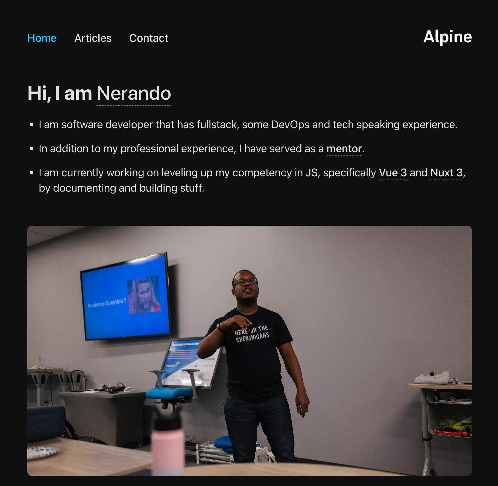

<!-- markdownlint-disable MD022 MD024 MD032 MD033 -->

# 100 Days of Code
<p class="toc"><a href="./index.html">&lt;– back to Table of Contents</a></p>

| Log 0 | Log 1 | Log 2 | Log 3 | Log Example |
| --- | --- | --- | --- | --- |
| [Log 0](log0.md) | [Log 1](log1.md) | [Log 2](log2.md) | this log |  [100 Days Round - Example](log8.html) |

## Challenge & Commitment
This is part of Alexander Kallaway's [100DaysOfCode](https://github.com/Kallaway/100-days-of-code "the official repo") challenge. More details about the challenge can be found here: [100daysofcode.com](http://100daysofcode.com/ "100daysofcode.com").

**Commitment:** *I will code daily for the next 100 days.*

|  Start Date   | End Date     |
| ------------- | ------------ |
| December 20, 2023 | March 28, 2024 |

## Primary Goals
- [ ] One hour of focused building daily.
- [ ] One hour of focused learning via a tutorial daily.
- [ ] Add a #tag searching capability to/on my hosted blog.
- [ ] Update current blog in my job's framework.
- [ ] Complete Front End Development Libraries Certification  ~> (freeCodeCamp).
- [ ] Complete the Data Vizualization Certification ~> (freeCodeCamp).
- [ ] Update Portfolio to Show Current Progress.

## Secondary Goals
- [ ] Create 4 opensource contributions.
- [ ] Build out 1 side project (Vue based with auth, home page, profile edit, crud features).
- [ ] Create WhatsApp projects page with a minimum number of 21 projects ( using [](https://codepen.io/FlorinPop17/full/VwYWMOa) as a model/ template.)

# Code Log

---

## 51. Blog via Astro Setup
### Day 40: Feb 8, 2024 - Friday

**Project:**
- Revamping Blog to Astro ~ Need to write copy.
- Learnt about localFetch Implementation in Vue.
- Framing learning at work prokect.

**Progress:**
Stuck ~ unplanned and tired.

**Thoughts:**
- Late night driving/ learning.

**Links/Memes:**


---

## 50. Blog via Astro Setup ~ Set Up and 1/2 Tweaking
### Day 40: Feb 8, 2024 - Thursday

**Project:**
- Revamping Blog to Astro ~ Tweaking the Navbar

**Progress:**
- Started to Work on it

**Thoughts:**
- Drop a gear and disappear.

**Links/Memes:**


---

## 49. Blog via Astro Setup ~ Research
### Day 49: Feb 7, 2024 - Wednesday

**Project:**

- Revamping Blog to Astro ~ Finding the right template is tricky (Found It).

**Progress:**
- Found right template for Astro

**Thoughts:**
- Killer Mike won the Grammy, got arrested, used $500k of his own $ to make the album.

**Links/Memes:**


---

## 48. Tired Day
### Day 48: Feb 6, 2024 - Tuesday

**Links/Memes:**


---

## 47. Sick Day
### Day 47: Feb 5, 2024 - Monday

**Links/Memes:**


---

## 46. Weekend Build && Blog via Astro Setup ~ Sick Day
### Day 46: Feb 4, 2024 - Sunday

**Project:**
- Weekend Build ~ Ber~kna ~> Still stuck abit but working on it [PAUSED].
- Revamping Blog to Astro ~ Finding the right template is tricky [PAUSED].

**Progress:**
- Re: weekend build ~ figuring it out but I am not feeling too well.

**Thoughts:**
- Killer Mike won the Grammy.

**Links/Memes:**


---

## 45. Weekend Build && Blog via Astro Setup
### Day 45: Feb 3, 2024 - Saturday

**Project:**
- Weekend Build ~ Ber~kna ~> Still stuck abit but working on it.
- Revamping Blog to Astro ~ Finding the right template is tricky.

**Progress:**
- Re: weekend build ~ still need get into the bug as I am stuck.
- Brand 3.0 ~> Need to find a blog that has a portfolio, blog, among other things.

**Thoughts:**
- Reframing the learning process by learning ~> distilling ~> building ~> documenting ~> teaching.

**Links/Memes:**


---

## 44. Back to Atlanta and Review Notes V2 : That Conference Post-OP
### Day 44: Feb 2, 2024 - Friday

**Project:**
- Revamping JS Skills : Scrimba .... Suspended by That Conference 2024 : Reviewing Notes
- Revamping a blog from Vue to Astro : Framing .... Suspended by That Conference 2024 : Travelling + Notes

**Progress:**
- Reviewing Notes from THAT Conf.

**Thoughts:**
- There is so much to learn, build, teach and do ..... Oh Lord ... Its an avalanche and a 4/2.

**Links/Memes:**


---

## 43. Back to Atlanta and Review Notes
### Day 43: Feb 1, 2024 - Thursday

**Project:**
- Revamping JS Skills : Scrimba .... Suspended by That Conference 2024 : Travelling + Notes
- Revamping a blog from Vue to Astro : Framing .... Suspended by That Conference 2024 : Travelling + Notes

**Progress:**
- Reviewing Notes from THAT Conf.

**Thoughts:**
- There is so much to learn, build, teach and do ..... Oh Lord ... Its an avalanche and a 3/2.

**Links/Memes:**


---

## 42. That Conference ~ Day 3
### Day 42: January 31, 2024 - Wedneday

**Project:**
- Revamping JS Skills : Scrimba .... Suspended by That Conference 2024
- Revamping a blog from Vue to Astro : Framing .... Suspended by That Conference 2024

**Progress:**
- Lots of notes to make or review from the sessions from Day 3 of That Conference.

**Thoughts:**
- There is so much to learn, build, teach and do ..... Oh Lord ... Its an avalanche and a 2/2.

**Links/Memes:**


---

## 41. That Conference ~ Day 2
### Day 41: January 30, 2024 - Tuesday

**Project:**
- Revamping JS Skills : Scrimba .... Suspended by That Conference 2024
- Revamping a blog from Vue to Astro : Framing .... Suspended by That Conference 2024

**Progress:**
- Lots of notes to make or review from the sessions from Day2 of That Conference.

**Thoughts:**
- There is so much to learn, build, teach and do ..... Oh Lord ... Its an avalanche.

**Links/Memes:**


---

## 40. That Conference ~ Day 1
### Day 40: January 29, 2024 - Monday

**Project:**
- Revamping JS Skills : Scrimba .... Suspended by That Conference 2024
- Revamping a blog from Vue to Astro : Framing .... Suspended by That Conference 2024

**Progress:**
- Lots of notes to make or review from the sessions from Day1 of That Conference.

**Thoughts:**
- There is so much to learn, build, teach and do.

**Links/Memes:**


---

## 39. Read Code and Travelling to That Conference
### Day 39: January 28, 2024 - Sunday

**Project:**
- Revamping JS Skills : Scrimba .... Still, Nope Not Today
- Revamping a blog from Vue to Astro : Framing

**Progress:**
- Blog : Framing out or understanging how to frame blog in Astro
- Learning // Building in JavaScript : Stuck for a bit to understand how JS works.

**Thoughts:**
Pacing and filling the holes of knowledge.

**Links/Memes:**


--

## 38. Changing Gears
### Day 38: January 27, 2024 - Saturday

**Project:**
- Revamping JS Skills : Scrimba .... Still, Nope Not Today
- Revamping a blog from Vue to Astro : Framing

**Progress:**
- Blog : Framing out or understanging how to frame blog in Astro
- Learning // Building in JavaScript : Stuck for a bit to understand how JS works.

**Thoughts:**
Pacing and filling the holes of knowledge.

**Links/Memes:**


--

## 37. Changing Gears
### Day 37: January 26, 2024 - Friday

**Project:**
- Revamping JS Skills : Scrimba .... Still, Nope Not Today
- Revamping a blog from Vue to Astro : Framing

**Progress:**
- Blog : Framing out or understanging how to frame blog in Astro
- Learning // Building in JavaScript : Stuck for a bit to understand how JS works.

**Thoughts:**
Pacing and filling the holes of knowledge.

**Links/Memes:**


--

## 36. Nada ~ Stuck for a bit
### Day 36: January 25, 2024 - Thursday

**Project:**
- Revamping JS Skills : Scrimba .... Nope Not Today
- Revamping a blog from Vue to Astro

**Progress:**
- Found the right blog template and gonna push it.

**Thoughts:**
A bit out of it but made some progress at the end.

**Links/Memes:**


--

## 35. Revamping JS Skills && Contract Wrk
### Day 35: January 24, 2024 - Wednesday

**Project:**
- Revamping JS Skills : Scrimba
- Contract Wrk : OnGoing

**Progress:**
- Nothing

**Thoughts:**
Dry but still at it.

**Links/Memes:**


--

## 34. Revamping JS Skills && Contract Wrk
### Day 34: January 23, 2024 -  Tuesday

**Project:**
- Revamping JS Skills : Scrimba
- Contract Wrk : OnGoing

**Progress:**
- Need to get ether better at notes, the building and learning process helped.

**Thoughts:**
Focused practice is a good thing but getting there.

**Links/Memes:**


--

## 33. Revamping JS Skills && Contract Wrk
### Day 33: January 22, 2024 - Monday

**Project:**
- Revamping JS Skills : Scrimba
- Contract Wrk : OnGoing

**Progress:**
- Need to get ether better at notes, the building and learning process helped.

**Thoughts:**
Focused practice is a good thing but getting there.

**Links/Memes:**


--

## 32. Ber-kna ~ FCC FEDLC
### Day 32: January 21, 2024 - Sunday

**Project:**
- Ber-kna : FCC FEDLC project

**Progress:**
- Worked on the tests for Ber-kna but its still broken.

**Thoughts:**
Still this ~> Reviewed the goals and took time revise specifically what needs to be built and what needs to be learnt.

**Links/Memes:**
[Ber-kna's current state](http://tinyurl.com/bdjp4xcf)

--

## 31. Ber-kna ~ FCC FEDLC
### Day 31: January 20, 2024 - Saturday

**Project:**
- Ber-kna : FCC FEDLC project

**Progress:**
- Nope, Stuck ...  Yes Still

**Thoughts:**
I will quit but for tomorrow.

**Links/Memes:**
[Ber-kna's current state](http://tinyurl.com/bdjp4xcf)

--

## 30. Ber-kna ~ FCC FEDLC
### Day 2: January 19, 2024 - Friday

**Project:**
- Ber-kna : FCC FEDLC project

**Progress:**
- Nope, Stuck

**Thoughts:**
I will quit but for tomorrow.

**Links/Memes:**
[Ber-kna's current state](http://tinyurl.com/bdjp4xcf)

--

## 29. Ber-kna ~ FCC FEDLC
### Day 29: January 18, 2024 - Thursday

**Project:**
- Ber-kna : FCC FEDLC project

**Progress:**
- Got 13/16 test to pass and refactored some of the code.

**Thoughts:**
I will quit but for tomorrow.

**Links/Memes:**
[Ber-kna's current state](http://tinyurl.com/bdjp4xcf)

--

## 28. Vue Mastery : Recap  && Code Log Tweaking
### Day 28: January 17, 2024 - Wednesday

**Project:**
- Vue Mastery : Beginner Track ~ Reviewing notes
- #100DaysOfCode Log : Tweaking

**Progress:**
- Vue Mastery ~ Creating a list of things do and write about but here are some cool tools :[TypeScript Cheatsheet](https://www.typescriptlang.org/cheatsheets), [Pinia Cheatsheet](https://www.vuemastery.com/pinia/?coupon=PINIA-DOCS&via=eduardo#cheat-sheet) and the [Vue3 Cheatsheet](https://learnvue.co/LearnVue-Vue-3-Cheatsheet.pdf).

- #100DaysOfCode Log : Tweaking the layout on my code log and realising that some goals needs to be specified.

**Thoughts:**
Keep going, adjust accordingly, but keep going.

**Links/Memes:**


---

## 27. Vue Mastery  && ??? ~ Nadah
### Day 27: January 16, 2024 - Tuesday

**Project:**
Completion of Vue Mastery Beginner Track.
Found or got help on digital gardens.

**Progress:**
Completed the Testing section of Vue Mastery and made notes.

**Thoughts:**
Reformed the chain today and felt better about it.

**Links/Memes:**


---

## 26. FCC Weekend Project
### Day 26: January 15, 2024 - Monday

**Project:**
Nada / Zilch / Nyet

**Progress:**
404 Not Found

**Thoughts:**
Broke the chain today, honesty shouldn't have but just tired and frustrated.

**Links/Memes:**


---

## 25. FCC Weekend Project
### Day 24: January 14, 2024 - Sunday

**Project:**
Building ~ FCC_FEDLC : Ber-Kna

**Progress:**
- Completed building out the framework for the javascript calculator.

**Thoughts:**
A completetly tired but did something today. I forgot to take my nap today
 and

**Links/Memes:**


---

## 24. FCC Weekend Project
### Day 24: January 13, 2024 - Sunday

**Project:**
Building ~ FCC_FEDLC : Ber-Kna

**Progress:**
- Completed building out the framework for the javascript calculator.

**Thoughts:**
A completetly tired but did something today. I forgot to take my nap today

**Links/Memes:**


---

## 23. Vue Mastery && Undecided Project --- ???
### Day 23: January 12, 2024 - Friday

**Project:**
Learning ~ Vue Mastery : Started Unit Testing Vue 3 ~ Stuck
Building ~ ??? || Still Nope

**Progress:**
- Vue Mastery: Started Unit Testing Vue 3 : Needed sleep.... update dependencies and recheck.
- Wrk for 1 focused hr ~> Found what to fix but tired.

**Thoughts:**
Fixed and improved its functionality.

**Links/Memes:**


---

## 22. Vue Mastery && Undecided Project --- ???
### Day 22: January 11, 2024 - Thursday

**Project:**
Learning ~ Vue Mastery : Started Unit Testing Vue 3 ~ Stuck
Building ~ ??? || Undecided

**Progress:**
- Vue Mastery: Started Unit Testing Vue 3 : This shit is broken. This code is buggy and 3 years old.
- Wrk for 1 focused hr ~> Nope || Not sure what to build or where to start on what to build.

**Thoughts:**
Frustrated AF.

**Links/Memes:**


---

## 21. Vue Mastery && ????
### Day 21: January 10, 2024 - Wednesday

**Project:**
Learning ~ Vue Mastery : Started Unit Testing Vue 3
Building ~ ???

**Progress:**
- Vue Mastery: Started Unit Testing Vue 3 : completed 1 module and started another. This code is buggy and 3 years old.
- Wrk for 1 focused hr ~> Nope || Need to refocus on the building

**Thoughts:**
I am getting better at this, but its still buggy for me to work on.

**Links/Memes:**


---

## 20. Vue Mastery && Blog Fixes
### Day 20: January 9, 2024 - Tuesday

**Project:**
Learning ~ Vue Mastery : Completed Vue with TypeScript
Building ~ Trying to create a subdomain for blog.

**Progress:**
- Vue Mastery: Maded sense with Vue & TypeScript : completed 2 modules. This code is buggy and 3 years old.
- Wrk for 1 focused hr ~> Trying to create a sub domain that points to my blog ~> Nope

**Thoughts:**
I am getting better at this, but its still buggy for me to think about.

**Links/Memes:**


---

## 19. Vue Mastery && Blog fixes
### Day 19: January 8, 2024 - Monday

**Project:**
Learning ~ Vue Mastery : Started Vue with TypeScript
Building ~ Trying to create a subdomain for blog.

**Progress:**
- Vue Mastery: Maded sense with Vue & TypeScript : completed 2 modules.
- Wrk for 1 focused hr ~> Trying to create a sub domain that points to my blog.

**Thoughts:**
Woke up to early but made some use of the end of the day.

**Links/Memes:**


---

## 18. Vue Mastery && Completed tRumma
### Day 18: January 7, 2024 - Sunday

**Project:**
Learning ~ Vue Mastery : Started Vue with TypeScript
Building ~ Completed tRumma's functionality

**Progress:**
- Vue Mastery: stuck and took a break off.
- tRumma ~> Completed v1, need to add more bells and whistles.

**Thoughts:**
Pleased today and making progress and spoke to Glenn.

**Links/Memes:**


---

## 17. Vue Mastery && Revamping tRumma
### Day 17: January 6, 2024 - Saturday

**Project:**
Learning ~ Vue Mastery : Started Vue with TypeScript
Building ~ Reworking outline or file structure of the tRumma project

**Progress:**
- Completed more two lessons from Vue Mastery.
- tRumma ~> Re:Outline the app structure, adding TypeScript and lay the foundation.

**Thoughts:**
Pleased today and making progress.

**Links/Memes:**


---

## 16. Vue Mastery && Revamping tRumma
### Day 16: January 5, 2024 - Friday

**Project:**
Learning ~ Vue Mastery : Started Vue with TypeScript
Building ~ Reworking outline or file structure of the tRumma project

**Progress:**
- Completed Two lessons from Vue Mastery
- tRumma ~> Re:outline the app structure and lay the foundation.

**Thoughts:**
I am evaluating how I spent my time and I am not pleased.
I also need to up my game, focus, quantity and quantity of my work.

**Links/Memes:**


---

## 15. Vue Mastery
### Day 15: January 4, 2024 - Thursday

**Project:**
Learning ~ Vue Mastery : Completed Pinia foundamentals

**Progress:**
- Completed Two lessons from Vue Mastery

**Thoughts:**
I will quit, but tomorrow.

**Links/Memes:**


---

## 14. Vue Mastery
### Day 14: January 3, 2024 - Wednesday

**Project:**
Learning ~ Vue Mastery : Pinia foundamentals ~> 1/2 way through

**Progress:**
- Notes and two lessons from Vue Mastery

**Thoughts:**
I will quit, but tomorrow.

**Links/Memes:**


---

## 13. Vue Mastery
### Day 13: January 2, 2024 - Tuesday

**Project:**
Learning ~ Vue Mastery : Completed the previopus module and started Pinia foundamentals

**Progress:**
- Notes and two lessons from Vue Mastery

**Thoughts:**
I will quit, but tomorrow.

**Links/Memes:**


---


## 12. Vue Mastery
### Day 12: January 1, 2023 - Monday

**Project:**
Learning ~ Vue Mastery : Touring Vue Router (Composition API) ~> Completed 2 Lessons

**Progress:**
- Vue Mastery : Completed 2 lessons of Touring Vue Router :Composition API

**Thoughts:**
I am tired and Happy New year. I will quit, but tomorrow.

**Links/Memes:**


---

## 11. Vue Mastery
### Day 11: December 31, 2023 - Sunday

**Project:**
Learning ~ Vue Mastery : Touring Vue Router (Composition API) ~> Completed 2 Lessons

**Progress:**
- Vue Mastery : Completed 2 lessons of Touring Vue Router :Composition API

**Thoughts:**
I am tired and Happy New year. I will quit, but tomorrow.

**Links/Memes:**


---

## 10. Vue Mastery && Blog Updates && Portfolio
### Day 10: December 30, 2023 - Saturday

**Project:**
Learning ~ Vue Mastery : Touring Vue Router (Composition API) ~> Completed 3 Lessons
Building/Fixes > Blog (Restructuring Image Layouts) && Updating Css Portfolio

**Progress:**
- Blog Renovations ~ Cover image is fixed for the readMe blog.
- Vue Mastery : Completed 3 lessons of Touring Vue Router :Composition API

**Thoughts:**
I have determined where the energy leaks are, fixing them. I will quit, but tomorrow.

**Links/Memes:**


___

## 9. Blog Relocation
### Day 9: December 29, 2023 - Friday

**Project:**
Building > Blog Relocation v2 and image fixes

**Progress:**
- Blog Relocation ~ Cover image is broken for the readMe blog but the 4th is up.

**Thoughts:**
I am tired.
I will quit, but tomorrow.

**Links/Memes:**


___

## 8. Vue Mastery && Blog Relocation
### Day 8: December 28, 2023 - Thursday

**Project:**
Learning ~ Vue Mastery : Touring Vue Router (Composition API)
Building > Blog Relocation

**Progress:**
- Vue Mastery : Stuck on  lesson 4 of Touring Vue Router (Composition API) : Nested Routes .... seen you tomorrow.
- Blog Relocation ~ Cover image is broken for the readMe blog but the 4th is up.

**Thoughts:**
I feel like I am loosing steam but I am seeing the time leak in my day ... fixing them.
I will quit, but tomorrow.

**Links/Memes:**


___

## 7. Vue Mastery && Blog Relocation
### Day 7: December 27, 2023 - Wednesday

**Project:**
Learning ~ Vue Mastery : Touring Vue Router (Composition API)
Building > Blog Relocation

**Progress:**
- Vue Mastery : Completed 3 lesson of Touring Vue Router (Composition API)
- Blog Relocation ~ Cover image is broken for the readMe blog but the 3rd is up.

**Thoughts:**
- Again:  I will quit, but tomorrow.

**Links/Memes:**


---

## 6. Vue Mastery && Blog Relocation
### Day 6: December 26, 2023 - Tuesday

**Project:**
Learning ~ Vue Mastery : Touring Vue Router (Composition API)
Building > Blog Relocation

**Progress:**
- Vue Mastery : Completed 2 lesson of Touring Vue Router (Composition API)
- Blog Relocation ~ Cover Image is broken for the readMe blog.

**Thoughts:**
- Again:  I will quit tomorrow.

**Links/Memes:**


---

## 5. Vue Mastery && Wkend Builds
### Day 5: December 25, 2023 - Monday

**Project:**
Learning ~ Vue Mastery : Composition API
Building > tRumma ~> N/A
** Consulting : Fixing and Updating Architecture


**Progress:**
- Vue Mastery : Completed lesson of Real World Vue (Composition API) : Deployment and Scaling
- tRumma ~ Stuck for a bit

**Thoughts:**
- Again:  I will quit tomorrow.

**Links/Memes:**


---

## 4. Vue Mastery && Blog Fixing
### Day 4: December 24, 2023 - Sunday

**Project:**
Learning ~ Vue Mastery : Composition API
Building > Blog Demo ~> 1st article


**Progress:**
- Vue Mastery : Completed lesson of Real World Vue (Composition API) : Dynamic Routing
                Some of the functions were broken and #ChapGpt and #Bard helped.
- Blog Revamp : Transfered 1st blog from Dev.to, .

**Thoughts:**
- Again:  I will quit tomorrow.

**Links/Memes:**


---

## 3. Vue Mastery && Weekend Project
### Day 3: December 23, 2023 - Saturday

**Project:**
Learning ~ Vue Mastery : Composition API ~> API Calls with Axios
Building > Trumma


**Progress:**
- Vue Mastery : Completed lesson of Real World Vue (Composition API) : API Calls with Axios
- Trumma : Got the music files in the right place and play with the wrong keypress and on the right ones also.

**Thoughts:**
- When it gets extremely hard; I will quit tomorrow.

**Links/Memes:**


---

## 2. Blog Development && Vue Mastery
### Day 2: December 22, 2023 - Friday

**Project:**
Learning and Building v0.3

**Progress:**
- Vue Mastery : Completed lesson of Real World Vue (Composition API) : Vue Router Essentails
- Made the Alpine nuxt template blog Vervel-hosted.

**Thoughts:**
- Make it to the next mind-meal either fullfilled or some-what (rest), remember its all on you and make it happen.

**Links/Memes:**


---

## 1. Blog Development && Vue Mastery
### Day 1: December 21, 2023 - Thursday

**Project:**
Learning and Building v0.2

**Progress:**
- Vue Mastery : Completed lesson of Real World Vue (Composition API).
- Revamping or Retrofiting the Alpine nuxt template to serve a self-hosted blog [Completed the index retro-fit].
[](./assets/images/log3/day3_blog_demo.png)

**Thoughts:**
- Process ensures progress, got some of it done.

**Links/Memes:**


---

## 0. Blog Retrofit && Vue Mastery
#### Day 0: December 20, 2023 - Wednesday

**Project:**
Learning and Building

**Progress:**
- Vue Mastery : Working through lesson 3ish of Real World Vue (Composition API).
- Revamping or Retrofiting the Alpine nuxt template to serve a self-hosted blog.

**Thoughts:**
- Process ensures progress.

**Links/Memes:**


---

## -1. Entry Example Title Example
### Day -1: Date - Day -1

**Project:**

**Progress:**
- This may include images like this :

```
import React from 'react';
import { connect } from 'react-redux';

```

or

[](./assets/images/day3.jpg)

**Thoughts:**

**Links/Memes:**

---
